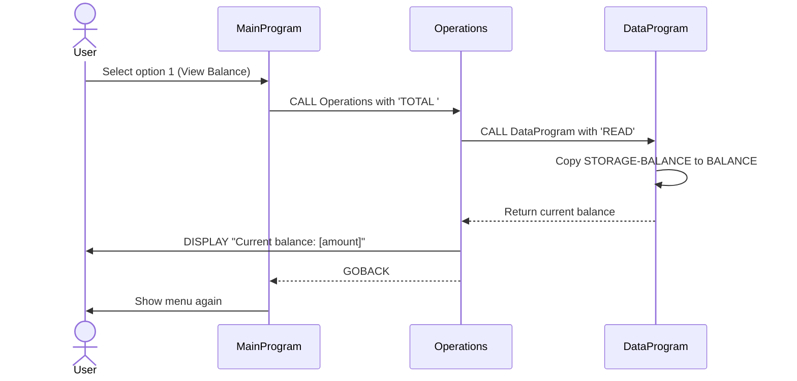
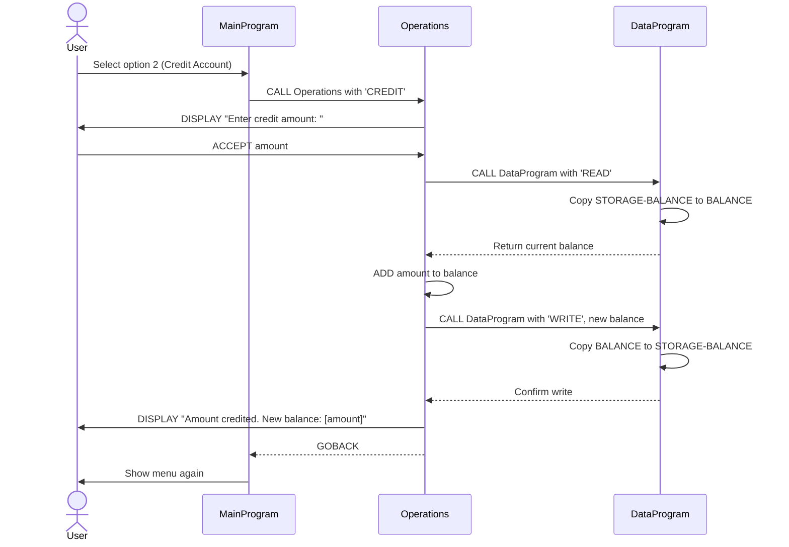
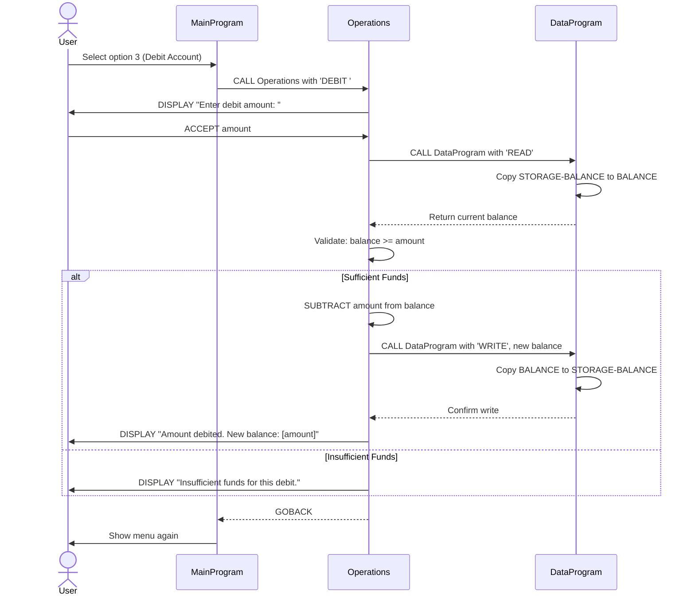
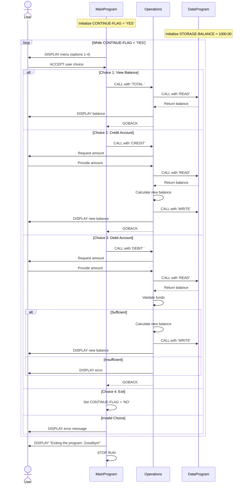

# COBOL Legacy Code Documentation

## Overview

This directory contains documentation for the legacy COBOL-based Account Management System. The system consists of three interconnected COBOL programs that work together to manage student account balances, including viewing, crediting, and debiting operations.

## System Architecture

The system follows a modular architecture with three distinct programs:

1. **MainProgram** - User interface and application controller
2. **Operations** - Business logic layer for account operations
3. **DataProgram** - Data access layer for balance management

## COBOL Files

### 1. main.cob (MainProgram)

**Purpose:**  
Serves as the main entry point and user interface for the Account Management System. It presents a menu-driven interface and orchestrates calls to the business logic layer.

**Key Functions:**
- `MAIN-LOGIC`: Primary procedure that runs the application loop
  - Displays the main menu with four options
  - Accepts user input for menu selection
  - Routes requests to the appropriate operation handler
  - Manages application lifecycle (continue/exit)

**User Interface Options:**
1. View Balance - Displays current account balance
2. Credit Account - Add funds to the account
3. Debit Account - Withdraw funds from the account
4. Exit - Terminate the program

**Business Rules:**
- Validates user input to ensure selection is between 1-4
- Displays error message for invalid choices
- Continues operation loop until user selects Exit option
- Calls the Operations program with specific operation codes:
  - `'TOTAL '` for viewing balance
  - `'CREDIT'` for crediting account
  - `'DEBIT '` for debiting account

**Data Structures:**
- `USER-CHOICE`: Numeric field (1 digit) to store menu selection
- `CONTINUE-FLAG`: Text field ('YES'/'NO') to control application loop

---

### 2. operations.cob (Operations)

**Purpose:**  
Implements the business logic layer for all account operations. Acts as an intermediary between the user interface (MainProgram) and data access layer (DataProgram).

**Key Functions:**

#### View Balance (TOTAL)
- Retrieves current balance from DataProgram using 'READ' operation
- Displays the current balance to the user

#### Credit Account (CREDIT)
- Prompts user to enter the credit amount
- Retrieves current balance from DataProgram
- Adds the credit amount to the current balance
- Persists the updated balance via DataProgram using 'WRITE' operation
- Displays the new balance to the user

#### Debit Account (DEBIT)
- Prompts user to enter the debit amount
- Retrieves current balance from DataProgram
- Validates that sufficient funds are available
- If sufficient funds exist:
  - Subtracts the debit amount from current balance
  - Persists the updated balance via DataProgram
  - Displays the new balance
- If insufficient funds:
  - Displays error message and does not process the transaction

**Business Rules:**
- **Insufficient Funds Protection**: Prevents debits that would result in negative balances
- **Balance Validation**: Always reads current balance before performing credit/debit operations
- **Transaction Atomicity**: Updates are only persisted after successful calculation
- **No Negative Balances**: System enforces a zero-minimum balance rule for student accounts

**Data Structures:**
- `OPERATION-TYPE`: Text field (6 characters) to identify the operation type
- `AMOUNT`: Decimal field (6 digits + 2 decimal places) for transaction amounts
- `FINAL-BALANCE`: Decimal field (6 digits + 2 decimal places) to store current/updated balance
- `PASSED-OPERATION`: Linkage parameter receiving operation code from MainProgram

**Validation Rules:**
- Maximum balance: 999,999.99 (based on PIC 9(6)V99 definition)
- Debit amount cannot exceed current balance
- All amounts support two decimal places for cents

---

### 3. data.cob (DataProgram)

**Purpose:**  
Provides the data access layer for the Account Management System. Manages the persistent storage and retrieval of the account balance.

**Key Functions:**

#### READ Operation
- Returns the current stored balance to the calling program
- Copies `STORAGE-BALANCE` to the `BALANCE` parameter

#### WRITE Operation
- Updates the stored balance with a new value
- Copies the `BALANCE` parameter to `STORAGE-BALANCE`

**Business Rules:**
- **Initial Balance**: Student accounts start with a default balance of $1,000.00
- **Single Account Model**: Currently manages one account balance (stored in `STORAGE-BALANCE`)
- **In-Memory Persistence**: Balance is maintained in working storage during program execution
- **No External Database**: This implementation does not persist data to files or databases between program runs

**Data Structures:**
- `STORAGE-BALANCE`: Decimal field (6 digits + 2 decimal places) storing the account balance
  - Default value: 1000.00
- `OPERATION-TYPE`: Text field (6 characters) to identify read/write operation
- `PASSED-OPERATION`: Linkage parameter receiving operation code ('READ' or 'WRITE')
- `BALANCE`: Linkage parameter for transferring balance data

**Data Limitations:**
- Maximum balance capacity: $999,999.99
- Precision: Two decimal places (cents)
- No transaction history or audit trail
- Balance resets to $1,000.00 on program restart

---

## Program Flow

```
User → MainProgram → Operations → DataProgram
                         ↓
                   Balance Storage
```

1. User interacts with **MainProgram** menu
2. **MainProgram** calls **Operations** with operation type
3. **Operations** processes business logic and calls **DataProgram** for data access
4. **DataProgram** reads or writes the balance
5. **Operations** returns results to **MainProgram**
6. **MainProgram** displays results to user

## Student Account Business Rules Summary

1. **Initial Balance**: All student accounts start with $1,000.00
2. **Minimum Balance**: Zero (no negative balances allowed)
3. **Maximum Balance**: $999,999.99
4. **Debit Protection**: Debits that exceed available balance are rejected
5. **Transaction Precision**: All amounts support two decimal places
6. **Data Persistence**: Balance is maintained in-memory only (resets on program restart)
7. **Single Account**: Current implementation supports one account at a time

## Technical Notes

- **COBOL Standard**: Programs follow traditional COBOL structure with IDENTIFICATION, DATA, and PROCEDURE divisions
- **Inter-Program Communication**: Uses CALL statement with USING clause for parameter passing
- **Data Types**: Numeric fields use PICTURE 9 with V for decimal point positioning
- **Program Termination**: Uses GOBACK for subprograms and STOP RUN for main program
- **Legacy Considerations**: This is legacy code that may benefit from modernization for:
  - External database integration
  - Multi-user support
  - Transaction logging
  - Error handling improvements
  - Security enhancements

## Future Modernization Opportunities

1. Convert to modern programming language (e.g., Python, Java, C#)
2. Implement database persistence for balance storage
3. Add transaction history and audit trail
4. Support multiple student accounts
5. Implement authentication and authorization
6. Add comprehensive error handling and logging
7. Create RESTful API for integration with modern systems
8. Implement unit tests and integration tests
9. Add data validation and sanitization
10. Support concurrent users with transaction locking

## Application Data Flow - Sequence Diagrams

The following sequence diagrams illustrate the data flow for each operation in the Account Management System.

### View Balance Operation



### Credit Account Operation



### Debit Account Operation (Successful)



### Complete Application Flow



### Key Data Flow Principles

1. **Separation of Concerns**: User interface (Main) is separated from business logic (Operations) and data access (Data)
2. **Centralized Data Access**: All balance operations go through DataProgram to ensure consistency
3. **Read-Modify-Write Pattern**: All updates follow the pattern: read current value → modify → write new value
4. **Validation in Business Layer**: Operations program handles all business rules (e.g., insufficient funds check)
5. **Stateful Data Layer**: DataProgram maintains the balance state in `STORAGE-BALANCE`
6. **Synchronous Communication**: All program calls are synchronous (CALL...GOBACK pattern)
7. **No Direct Data Access**: MainProgram never directly accesses the balance; it always goes through Operations
